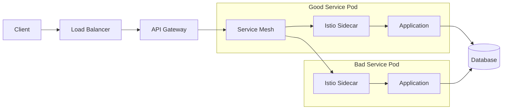

# Zero-Downtime Services: Kubernetes Lifecycle Management Demo


**Companion code for the blog post: ["Zero-Downtime Services: A Complete Guide to Lifecycle Management on Kubernetes"](https://shahbhat.medium.com/zero-downtime-services-with-lifecycle-management-on-kubernetes-and-istio-86decc2c52ae)**

This repository demonstrates the critical differences between properly configured services and anti-patterns in Kubernetes service lifecycle management. 

## 🎯 What You'll Learn

- **Startup Race Conditions**: Why services crash during initialization and how to fix it
- **Health Check Patterns**: The difference between liveness, readiness, and startup probes
- **Graceful Shutdown**: How to prevent dropped requests during deployments
- **Data Consistency**: Protecting against corruption during unsafe shutdowns
- **Istio Integration**: Service mesh lifecycle coordination
- **Anti-Corruption Patterns**: Automatic detection and repair of data inconsistencies

## 🏗️ Architecture Overview



The demo includes two identical applications with different Kubernetes configurations:
- **`bad-service`**: Demonstrates anti-patterns and common mistakes
- **`good-service`**: Shows production-ready best practices

## 🔧 Prerequisites

- **Kubernetes cluster** (1.23+ recommended for native gRPC health probes)
  - Docker Desktop, minikube, GKE, EKS, or AKS
- **kubectl** configured and connected to your cluster
- **Docker** for building images
- **Go 1.23+** for running the client
- **Istio** (optional, for service mesh testing)

### Quick Cluster Setup Options

<details>
<summary>Docker Desktop (Recommended for local testing)</summary>

1. Install [Docker Desktop](https://www.docker.com/products/docker-desktop)
2. Enable Kubernetes in Settings → Kubernetes
3. Wait for cluster to be ready: `kubectl cluster-info`
</details>

<details>
<summary>Google Kubernetes Engine (GKE)</summary>

```bash
# Create cluster
gcloud container clusters create lifecycle-demo \
  --zone=us-central1-a \
  --num-nodes=3 \
  --enable-autoscaling \
  --min-nodes=1 \
  --max-nodes=5

# Get credentials
gcloud container clusters get-credentials lifecycle-demo --zone=us-central1-a
```
</details>

<details>
<summary>Amazon EKS</summary>

```bash
# Install eksctl first
eksctl create cluster --name lifecycle-demo --region us-west-2 --nodes 3
```
</details>

## 🚀 Quick Start

### 1. Clone and Setup

```bash
git clone https://github.com/bhatti/safe-lifecycle.git
cd safe-lifecycle

# Create namespace
kubectl apply -f k8s/00-namespace.yaml
```

### 2. Build and Deploy

```bash
# Build the Docker image
docker build -t safe-lifecycle:latest .

# For Docker Desktop, load the image
docker save safe-lifecycle:latest | docker load

# Deploy both services
kubectl apply -f k8s/
```

### 3. Verify Deployment

```bash
# Check pods status
kubectl get pods -n lifecycle-demo

# Expected output:
# NAME                           READY   STATUS    RESTARTS   AGE
# bad-service-xxx               0/1     Running   2          2m
# good-service-yyy              1/1     Running   0          2m
```

Notice that `bad-service` has restarts and is not ready, while `good-service` is healthy!

## 🧪 Testing Scenarios

### Test 1: Startup Behavior - The Restart Loop Problem

**Objective**: See how misconfigured health checks cause restart loops.

**Watch the startup behavior in real-time:**

```bash
# Terminal 1: Monitor pods
watch kubectl get pods -n lifecycle-demo

# Terminal 2: Trigger restarts and observe
kubectl delete pod -l app=bad-service -n lifecycle-demo
kubectl delete pod -l app=good-service -n lifecycle-demo
```

**What you'll observe:**

| Service | Behavior | Explanation |
|---------|----------|-------------|
| `bad-service` | 🔴 Restart loop, never becomes ready | Liveness probe kills container before 60s startup completes |
| `good-service` | ✅ Stays `0/1 READY` for ~60s, then becomes `1/1 READY` | Startup probe allows time for initialization |

**Key Learning**: Startup probes prevent restart loops during slow initialization.

### Test 2: Health Check Depth - Dependency Failure Handling

**Objective**: Compare shallow vs deep health checks.

```bash
# Terminal 1: Start client for good-service
go run client/main.go localhost:30002

# Terminal 2: Port forward for management API
POD_NAME=$(kubectl get pods -n lifecycle-demo -l app=good-service -o jsonpath='{.items[0].metadata.name}')
kubectl port-forward -n lifecycle-demo $POD_NAME 9090:9090

# Terminal 3: Monitor pod readiness
watch "kubectl get pods -n lifecycle-demo -l app=good-service"
```

**Simulate dependency failure:**

```bash
# Make the "database" unhealthy
curl http://localhost:9090/toggle-db-health

# Watch Terminal 1: Client immediately starts failing ❌
# Watch Terminal 3: Pod becomes 0/1 READY

# Restore health
curl http://localhost:9090/toggle-db-health

# Watch: Client succeeds again ✅, Pod becomes 1/1 READY
```

**Key Learning**: Deep readiness checks prevent traffic routing to unhealthy services.

### Test 3: Graceful Shutdown - Zero Dropped Requests

**Objective**: See the difference between abrupt and graceful termination.

```bash
# Terminal 1: Continuous requests to bad-service
while true; do
  echo "=== $(date) ==="
  go run client/main.go localhost:30001 || echo "Connection failed!"
  sleep 1
done

# Terminal 2: Continuous requests to good-service  
while true; do
  echo "=== $(date) ==="
  go run client/main.go localhost:30002 || echo "Connection failed!"
  sleep 1
done

# Terminal 3: Trigger shutdowns
kubectl scale deployment bad-service -n lifecycle-demo --replicas=0
# Watch Terminal 1: Immediate errors 🔴

# Wait 30 seconds, then:
kubectl scale deployment good-service -n lifecycle-demo --replicas=0
# Watch Terminal 2: Continues working for 10-15 seconds! ✅
```

**Key Learning**: Proper shutdown hooks and grace periods prevent dropped requests.

## 🌐 Istio Service Mesh Testing (Optional)

If you have Istio installed, test advanced resilience features:

### Install Istio (if not already installed)

```bash
# Download and install Istio
curl -L https://istio.io/downloadIstio | sh -
export PATH=$PWD/istio-*/bin:$PATH

# Install Istio
istioctl install --set values.defaultRevision=default -y

# Enable sidecar injection
kubectl label namespace lifecycle-demo istio-injection=enabled

# Restart pods to get sidecars
kubectl rollout restart deployment -n lifecycle-demo
```

### Test Automatic Retries and Circuit Breaking

```bash
# Apply Istio configuration
kubectl apply -f istio/

# Test fault injection
for i in {1..50}; do
  grpcurl -H "x-chaos-test: true" -plaintext \
    good-service.lifecycle-demo.svc.cluster.local:8085 \
    demo.DemoService/DoWork \
    -d '{"data": "test-'$i'"}'
done

# Check Istio retry metrics
kubectl exec -n istio-system deployment/istiod -- \
  pilot-agent request GET stats/prometheus | grep retry
```

**Key Learning**: Istio provides automatic fault tolerance without code changes.

## 🔍 Configuration Comparison

### Bad Service Configuration (Anti-Patterns)

```yaml
# ❌ Missing startup probe
# ❌ Identical liveness and readiness probes  
# ❌ No preStop hook
# ❌ Default 30s termination grace period
# ❌ Missing Istio annotations
livenessProbe:
  exec:
    command: ["/bin/grpc_health_probe", "-addr=:8085"]
readinessProbe:
  exec:
    command: ["/bin/grpc_health_probe", "-addr=:8085"]  # Same as liveness!
```

### Good Service Configuration (Best Practices)

```yaml
# ✅ Startup probe for slow initialization
# ✅ Distinct liveness and readiness probes
# ✅ PreStop hook for graceful shutdown
# ✅ Calculated termination grace period
# ✅ Istio sidecar coordination
startupProbe:
  exec:
    command: ["/bin/grpc_health_probe", "-addr=:8085", "-service=readiness"]
  failureThreshold: 24  # 2 minutes startup time
livenessProbe:
  exec:
    command: ["/bin/grpc_health_probe", "-addr=:8085", "-service=liveness"]
readinessProbe:
  exec:
    command: ["/bin/grpc_health_probe", "-addr=:8085", "-service=readiness"]
lifecycle:
  preStop:
    exec:
      command: ["/bin/sh", "-c", "sleep 15"]
terminationGracePeriodSeconds: 65  # Calculated: 15s + 45s + 5s buffer
```

## 🎮 Interactive Game Day Exercises

### Exercise 1: Find the Anti-Pattern

Can you spot all the issues in `bad-service`? Run this command and analyze:

```bash
kubectl get deployment bad-service -n lifecycle-demo -o yaml | grep -A 10 -B 5 -E "(probe|gracePeriod|annotations)"
```

<details>
<summary>Click to reveal the issues</summary>

1. ❌ No startup probe - causes restart loops
2. ❌ Identical probes - no traffic protection  
3. ❌ No preStop hook - abrupt termination
4. ❌ Default grace period - insufficient shutdown time
5. ❌ Missing Istio annotations - sidecar race conditions
6. ❌ No resource limits - unpredictable performance

</details>

### Exercise 2: Chaos Engineering

Intentionally break things to test resilience:

```bash
# Kill random pods
kubectl delete pod $(kubectl get pods -n lifecycle-demo -o jsonpath='{.items[*].metadata.name}' | tr ' ' '\n' | shuf | head -1) -n lifecycle-demo

# Overload the service
kubectl run load-test --image=fortio/fortio --rm -it -- \
  load -c 10 -qps 100 -t 30s http://good-service.lifecycle-demo.svc.cluster.local:8085/health

# Network partitions (if using Istio)
kubectl apply -f istio/fault-injection.yaml
```

### Exercise 3: Performance Tuning

Optimize the configuration:

```bash
# Measure current startup time
kubectl delete pod -l app=good-service -n lifecycle-demo
time kubectl wait --for=condition=ready pod -l app=good-service -n lifecycle-demo --timeout=300s

# Try reducing startup delay
kubectl set env deployment/good-service -n lifecycle-demo STARTUP_DELAY=30s

# Measure again - should be faster!
```

## 🐛 Troubleshooting

### Common Issues and Solutions

<details>
<summary>📦 "ImagePullBackOff" errors</summary>

**Problem**: Kubernetes can't pull the Docker image.

**Solution**:
```bash
# For Docker Desktop:
docker build -t safe-lifecycle:latest .

# Update imagePullPolicy in manifests:
# imagePullPolicy: Never  # Use local image
```
</details>

<details>
<summary>🔄 "CrashLoopBackOff" on good-service</summary>

**Problem**: Even good-service is crashing.

**Debug steps**:
```bash
# Check logs
kubectl logs -l app=good-service -n lifecycle-demo

# Check probe configuration
kubectl describe pod -l app=good-service -n lifecycle-demo

# Verify image works locally
docker run --rm -p 8085:8085 safe-lifecycle:latest
```
</details>

<details>
<summary>🌐 Cannot connect to services</summary>

**Problem**: Client cannot reach services.

**Solutions**:
```bash
# Check services
kubectl get svc -n lifecycle-demo

# Try port-forwarding instead of NodePort
kubectl port-forward svc/good-service-svc 8085:8085 -n lifecycle-demo

# Update client to use localhost:8085
```
</details>

<details>
<summary>⏱️ Startup taking longer than expected</summary>

**Problem**: Services take too long to become ready.

**Debug**:
```bash
# Check probe timing
kubectl get pod -l app=good-service -n lifecycle-demo -o yaml | grep -A 5 startupProbe

# Watch probe events
kubectl get events -n lifecycle-demo -w | grep probe
```
</details>

## 📈 Key Metrics to Track

After running the tests, document these metrics:

| Metric | Bad Service | Good Service | Target |
|--------|-------------|--------------|--------|
| **Startup Time** | ∞ (restart loop) | ~60s | <2 minutes |
| **Restart Count** | High (5+) | 0 | 0 |
| **Shutdown Duration** | <5s (abrupt) | ~45s | 30-60s |
| **Request Success Rate** | 60-80% | 99.9%+ | >99.9% |
| **Recovery Time (RTO)** | Manual intervention | <5 minutes | <15 minutes |
| **Data Loss Window (RPO)** | Unknown | <15 seconds | <15 seconds |

## 🧹 Cleanup

```bash
# Remove all demo resources
kubectl delete namespace lifecycle-demo

# Remove Docker images
docker rmi safe-lifecycle:latest

# For cloud clusters, delete the cluster
# GKE: gcloud container clusters delete lifecycle-demo --zone=us-central1-a
# EKS: eksctl delete cluster lifecycle-demo
```

## 📚 Learn More

- 📖 **[Full Blog Post](https://shahbhat.medium.com/zero-downtime-services-with-lifecycle-management-on-kubernetes-and-istio-86decc2c52ae)**: Detailed explanation of all concepts
- 📖 **[Kubernetes Documentation](https://kubernetes.io/docs/tasks/configure-pod-container/configure-liveness-readiness-startup-probes/)**: Official probe documentation
- 📖 **[Istio Traffic Management](https://istio.io/latest/docs/concepts/traffic-management/)**: Service mesh patterns
- 📖 **[gRPC Health Checking](https://grpc.io/docs/guides/health-checking/)**: Protocol specification

## 📝 License

This project is licensed under the MIT License - see the [LICENSE](LICENSE) file for details.

## ⭐ Support

If this demo helped you understand Kubernetes lifecycle management, please ⭐ Star this repository.
